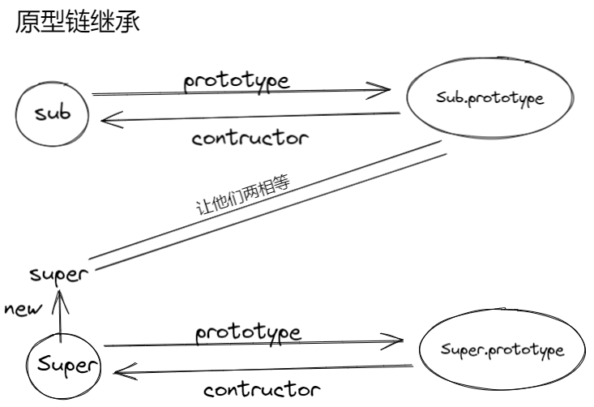
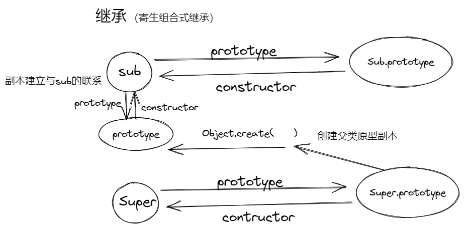
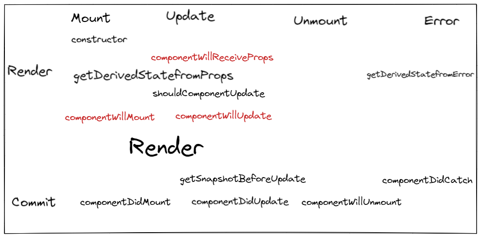
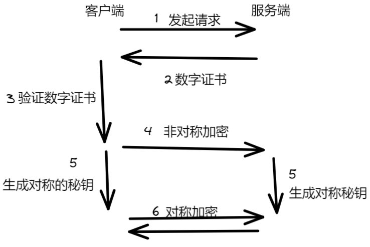
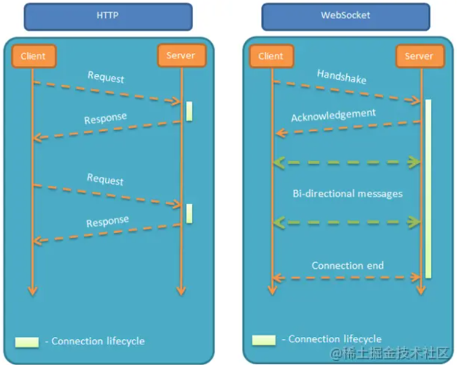

##  华为 OD 面试总结（offer）

这是一个内包（外包）

## 笔试

400分 时间两个半还是三个半小时来着<br />三道算法题：

1. 反转单词 - 双指针
1. 考察滑动窗口，最难
1. 车位问题 最短距离 indexof和 lastIndexof

性格测试

## 一面

###  自我介绍

### 判断数组的方法
- typeof 只能判断基本数据类型，不能回答这个
- 构造函数判断 instanceOf 可以判断对象类型
- Array原型判断：Array.prototype.isPrototypeOf(obj)
- 跨原型调用toString：Object.prototype.toString.call(obj)
- 数组方法 Array.isArray()


###  深拷贝 能写出来能说

```javascript
function deepClone(target,weakMap = new WeakMap()){
  if(typeof target !=='object' || target == null){
    if(target instanceof Function)return target.bind(this,...arguments)
    return target;
  }
  if(target instanceof Date)return new Date(target);
  if(target instanceof RegExp)return new RegExp(target);
  let res = new target.constructor()
  if(weakMap.get(target))return weakMap.get(target);
  weakMap.set(res,target);
  for(let key in target){
    res[key] = deepClone(target[key],weakMap)
  }
  return res
}

const a = {
  i: Infinity,
  s: "",
  bool: false,
  n: null,
  u: undefined,
  sym: Symbol(),
  obj: {
    i: Infinity,
    s: "",
    bool: false,
    n: null,
    u: undefined,
    sym: Symbol(),
  },
  array: [
    {
      nan: NaN,
      i: Infinity,
      s: "",
      bool: false,
      n: null,
      u: undefined,
      sym: Symbol(),
    },
    123,
  ],
  fn: function () {
    return "fn";
  },
  date: new Date(),
  re: /hi\d/gi,
};
let a2 = deepClone(a);
console.log(a2 !== a);
console.log(a2.i === a.i);
console.log(a2.s === a.s);
console.log(a2.bool === a.bool);
console.log(a2.n === a.n);
console.log(a2.u === a.u);
console.log(a2.sym === a.sym);
console.log(a2.obj !== a.obj);
console.log(a2.array !== a.array);
console.log(a2.array[0] !== a.array[0]);
console.log(a2.array[0].i === a.array[0].i);
console.log(a2.array[0].s === a.array[0].s);
console.log(a2.array[0].bool === a.array[0].bool);
console.log(a2.array[0].n === a.array[0].n);
console.log(a2.array[0].u === a.array[0].u);
console.log(a2.array[0].sym === a.array[0].sym);
console.log(a2.array[1] === a.array[1]);
console.log(a2.fn !== a.fn);
console.log(a2.date !== a.date);
console.log(a2.re !== a.re);
// 都要为 true
```
递归：

- 递归结束条件：基本数据类型直接返回
- 为引用数据类型则需要对这个引用继续深拷贝
- 注意存在循环引用的场景，所以用weaMap保存


### Promise的实现 能写出来能说明白

注意几点一定要说出来

- 状态转变从pending到fullfilled或者从pending到rejected
- 包含三部分，resolve函数：判断此时状态为pending，将状态转为fulfilled，执行then存放的成功回调。reject函数：同resolve逻辑。 以及trycatch 传入的执行函数。
- **Promise.then **的调用，三个状态做不同的事情，如果是fulfilled或者rejected那么执行onFulfilled回调函数 
- 最好自实现一次PromiseA+
```javascript
function Promise() {
  self.status = "pending"; // 默认的状态,只能改变一次
  self.value = null; // 成功的值
  self.reason = null; // 失败的原因
  self.onFulfilledCb = []; // 存放then成功的回调
  self.onRejectedCb = []; // 存放then失败的回调

  function resolve(value) {
    // 成功
    if (self.status === "pending") {
      self.status = "fulfilled";
      self.value = value;
      self.onFulfilledCb.forEach(function (fn) {
        fn();
      });
    }
  }

  function reject(reason) {
    // 失败
    if (self.status === "pending") {
      self.status = "rejected";
      self.reason = reason;
      self.onRejectedCb.forEach(function (fn) {
        fn();
      });
    }
  }

  try {
    executor(resolve, reject);
  } catch (e) {
    // 抛出错误，走失败的方法
    reject(e);
  }
}

Promise.prototype.then = function (onFulfilled, onRejected) {
  const self = this;
  if (self.status === "fulfilled") {
    onFulfilled(self.value);
  }
  if (self.status === "rejected") {
    onRejected(self.reason);
  }
  if (self.status === "pending") {
    // TODO 这里需要注意只能实现Promise实例可以多次.then没有实现then的链式调用（需要返回一个新的Promise）
    // 将成功的回调添加到数组中
    self.onFulfilledCb.push(function () {
      onFulfilled(self.value);
    });
    self.onRejectedCb.push(function () {
      onRejected(self.reason);
    });
  }
};


```

### ES6的新特性

可以看这篇：[https://es6.ruanyifeng.com/](https://es6.ruanyifeng.com/)

- 块级作用域的 let const
- 数据类型新增symbol
- 类class
- 箭头函数
- 模板字符串
- 解构
- Module 模板加载import
- Proxy
- Iterator（遍历器）和for...of
- Promise
- Generator 
- async await

###  原型和原型链  
考的是继承，多说自己知道的实现继承的方式

- 原型链继承
   - 
```javascript
关键在于
Sub.prototype = new Super()
```

- 构造函数继承
   - 是直接在Sub里调用Super 
- 组合继承，结合以上两点
- 原型式继承
   - 利用空对象做中介
- 寄生式继承
   - 在原型式基础上增强对象返回构造函数
- 寄生组合式继承
   - 最成熟的解决方案
   - 
   - tips其中sub里是使用Super.call(this)并在此基础上进行增强
- 混入继承
   - 使用Object..assign(...多个原型 )
- ES6实现继承Extends

###  定位性能问题怎么发现 


   1. 如果没有写优化后的数据，则可以答，肉眼可见的性能问题，如白屏、卡顿、加载时间很长
   1. 一般是要答带数据的优化
      1. lightHouse的评分，可以作为优化依据
      1. React性能检测的一些工具也可以：Profiler能测出reRender的耗时，平常对数据要求不严格，也就是不需要准确测出rerender的时间的话可以使用ReactDevtool
      1. 浏览器开发者工具可以检测到大部分的性能数据：
         1. 网络面板的一些优化方案：1.阻塞或者排队，由于一个域名最多维护6个链接，可以做域名分片或者多个域名。2.网络原因可以用CDN缓存 3.下载时间过长可以压缩，webpack打包优化。
         1. performance：
            1. FPS （Frames Per Second）每秒传输帧数，发现页面帧速图表出现红色块，代表一帧所需时间过长->卡顿。
            1. CPU图表显示占得面积太大，可能某个js占用太多主线程时间
            1. V8内存使用凸显一直上升，内存泄漏可能存在
###  怎么做性能优化

   1. 写React代码的优化 
      1. 减少计算
         1. 增加key
         1. commit阶段减少耗时操作
         1. 一些hook ： useMemo、useCallback、React.Memo
         1. setState将多个合并，或者用ustable_batchedUpdate批量更新
      2. 精细化渲染
         1. 优先用户响应，耗时任务放到下一个宏任务。“关闭弹窗类似的场景”
         1. usecontext跳过中间组件 ，发布订阅模式，redux
         1. useMemo也可以跳过render
      3. 控制范围
         1. 防抖节流
         1. 懒渲染（"虚拟列表"）、懒加载（webPack）
         1. 避免在didMount或didUpdate中更新state
   2. webpack的优化（除去开发环境的优化）
      1. 打包速度
         1. onOf、external 可以跳过loader的查找，除去一些不打包
         1. babel缓存，可以对运行结果缓存
         1. 多进程打包 thread-loader
      2. 运行性能
         1. 文件资源缓存 hash、chunkhash、contenthash，这几个的区别也要明白
         1. treeShacking
         1. code split
         1. 懒加载、预加载（某些浏览器不支持）
         1. 离线可访问 pwa  （也是一种优化，但用的不多）
   3. 网络等优化
      1. CDN缓存
      1. 域名分片
      1. 文件压缩
      1. DNS预解析，提前解析之后可能会用到的域名，`<meta http-equiv="x-dns-prefetch-control" content="on">`  手动：`<link rel="dns-prefetch" href="[http://www.google.com">](http://www.google.com">)`

###  TypeScript 一些问题

   1. 为什么要用TypeScript：1. 静态类型检查，编译时发现问题   2. 类接口的使用更加易于维护 3.重构更加方便，返回类型更加明确（可预知的类型）、可阅读性和维护性和可控->源于js是弱类型的语言。
   1. never类型、interface和type的区别：
      1. type可以声明基本类型别名type Name= string，联合类型 type Name= String|Number 、元祖type Name = [String|number]  等类型。
      1. interface 可以声明合并 ; interface User{name:string } interface User{sex:string} 
      1. 一般 interface 描述“数据结构”，type描述“类型关系”
   3. 泛型也可能被问到
      1. 这个可以根据你开发的重用组件来讲，会比较有效果；主要指解决重用组件的类型支持的，支持多种数据类型。其类型会像函数传参一样传递。

### 在公司做的工作，负责什么

这个需要自己总结，不可或缺，如果你在前公司负责的项目价值高。那么很有可能面试官会画时间多和你聊公司项目。所以还是要引起注意。

### 杨辉三角 
网上直接搜就能搜出答案哈，很简单的一道输出题，要快的写完~
```
   1
  121 
 12321
1234321
```

## 二面

### 问业务方面
###  React 相关问题
###  React生命周期 
主要点：挂载 -> 更新 -> 卸载 ->（Error）
   1. 
   1. 官网必须看，结合项目看，自己做也可以，深入的可以看源码-React技术揭秘
###  怎么理解React一切皆组件
   1. React采用组件化的思想，我们编写函数hook或者class其实都是在写组件，React中是编写jsx，React会将jsx声明的组件通过bebal转化成React.createElement形成虚拟DOM树。
   1. React的虚拟DOM树就是一个大的组件树。
   1. 组件可以是一个函数或者一个类，几首数据输入，处理它并返回UI中呈现的React元素。
###  不同组件数据的传递 
props、回调、父组件统一、useContext搭配redux
###  Vue angular
就简单的了解一下我对这两个库的理解情况
###  webpack怎么做优化  
 B站有视频自学的   两个环境：打包速度、调试；打包速度、运行性能
   1. webpack删除冗余代码
   1. 混淆打包
### 安全方面：XSS CSRF
   1. XSS跨站脚本攻击：
      1. 输入脚本进行过滤转码
      1. 利用CSP（"内容安全策略"）
      1. HttpOnly
      1. 验证码
      1. 限制长度（'效果不大，有脚本缩短的办法'）
   2. CSRF跨域请求伪造
      1. cookie SameSite属性
      1. 验证post请求的Origin
      1. CSRF Token
      1. x-frame-option 限制iframe展示
   3. 平时会用这些策略嘛？
### http协议
   1. http1.0和http1.1
      1. **缓存处理**：etag、if-none-match
      1. **长连接**
      1. 增加错误码
      1. host头处理
   2. http2.0
      1. **二进制协议**：头和数据帧
      1. **数据流**
      1. **多路复用 **- 解决队头阻塞
      1. 头信息压缩
      1. 推送 **服务器主动推送**
   3. http3.0
      1. 解决tcp它的队头阻塞 -> **udp协议**
         1. 基于**TCP**的HTTP/2，数据还是要一帧一帧的发送和接收，一旦某一个流的数据有丢包，则同样会阻塞在它之后传输的流数据传输。而基于**UDP**的QUIC协议则可以更为彻底地解决这样的问题，让不同的流之间真正的实现相互独立传输，互不干扰。
      2. **切换网络时的连接保持**
         1. 基于TCP的协议，由于切换网络之后，IP会改变，因而之前的**连接不可能继续保持**。而基于UDP的QUIC协议，则可以内建与TCP中不同的连接标识方法，从而在**网络完成切换之后，恢复之前与服务器的连接。**
###  https

[https://juejin.cn/post/6857287743966281736#heading-61](https://juejin.cn/post/6857287743966281736#heading-61)

   1. 非对称加密
   1. 数字证书
   1. 数字签名
   1. 
###  websorket
   1. 原理
      1. 基于tcp连接传输数据
      1. 通过http协议建立通道，在此基础进行websocket通信；与http的区别：
      1. 
   2. 持久通信 - 应用层协议也是基于 tcp的
   2. **服务器可以主动推送 ** - 双向
###  算法：约瑟夫环
（脑筋急转弯）我是做过这道题，但公式不记得了hh推了一会公式做出来的。
