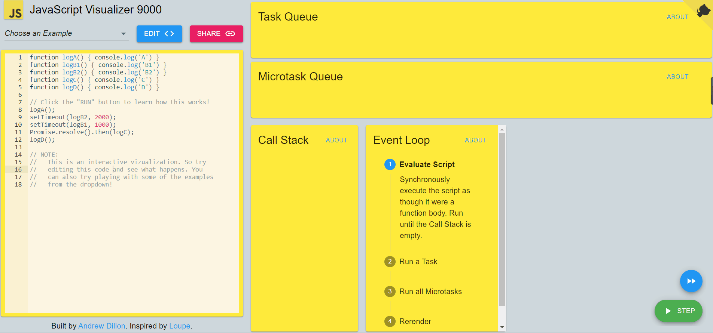
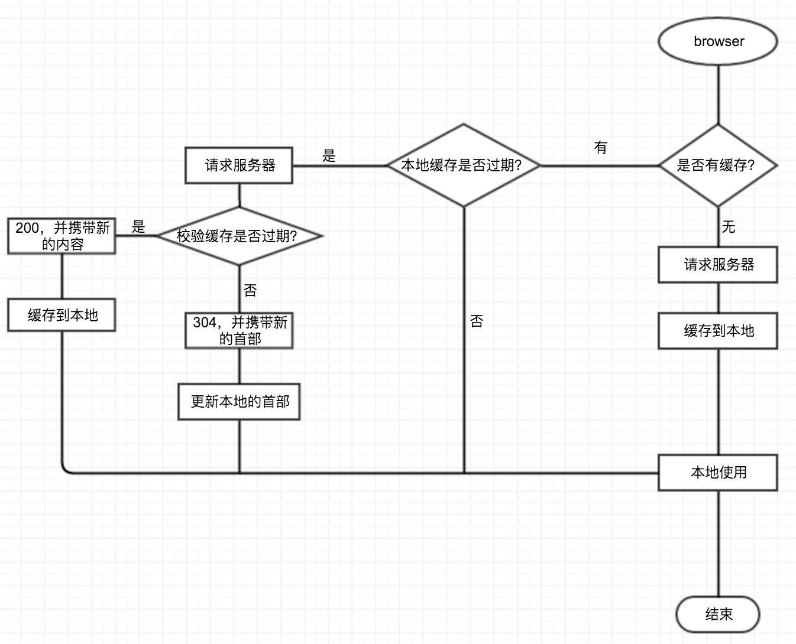

## 其他面的一些中小公司
没有再一个个给答案了，不知道的可以自己搜索一下。

### 生命周期
### React源码
- fiber架构
- React15与16的区别
- diff
- 如何进行任务中断与断点恢复
###  ts
装饰器、函数重载、never与interface
###  事件循环机制
   1. 同步事件栈
   1. 异步事件就到异步队列
      1. 宏任务 - 宏队列
      1. 微任务 - 微队列

图片帮助理解：

###  监听某个元素宽高 
MutationObserver
###   http1.0 1.1 2 
前面总结过：<a href='huawei-od#http协议'>答案链接</a>
###  浏览器缓存
etag和lastmodify的区别 - 强缓存和协商缓存

看图就完事了：

###  promise的核心
不讲细节实现聊核心

换一种问法，promise 怎么实现连续.then以及怎么实现finally

- 涉及这些核心：高阶函数、发布订阅、链式调用
- 链式调用，then 返回一个promise
- 如果不论成功还是失败都想执行一段代码(也就是在settled状态就执行)，可以使用.finally

### React state
vue里的赋值是同步的，那react里的赋值是同步还是异步的呢？
###  redux
状态管理，简述
追问： reducer为什么建议是纯函数呢？为什么会这么去设计？和vuex的区别？
###  react、vue的生命周期
### spa和mpa的区别
多页应用和单页应用的区别
### 路由跳转
单页怎么处理路由的
### 跨域
什么是跨域，一些解决方案，说了代理，什么是代理，什么是正向代理和反向代理
### 浏览器渲染机制
### 进程js是多进程吗？
### 事件循环的理解
###  egg.js
node中间件原理，koa和egg中间件的理解，洋葱模型
###  浏览器缓存
没有hash的文件：入口html文件 cache-control 设置为no-cache
###  防抖节流
###  闭包
###  this指向问题
### js继承
注意constructor要还原，聊一聊原型继承
###  怎么解决原型继承的污染
###  es6的新特性
###  模块module 
导入导出，es6 module和commenJs的区别：[https://juejin.cn/post/6844904067651600391](https://juejin.cn/post/6844904067651600391)
###  数组去重的方法
（应该是我没说set和map）
1、ES6 Set；
2、splice；
3、hash的思想：
可以用map存，也可以用indexOf或者include等来判断